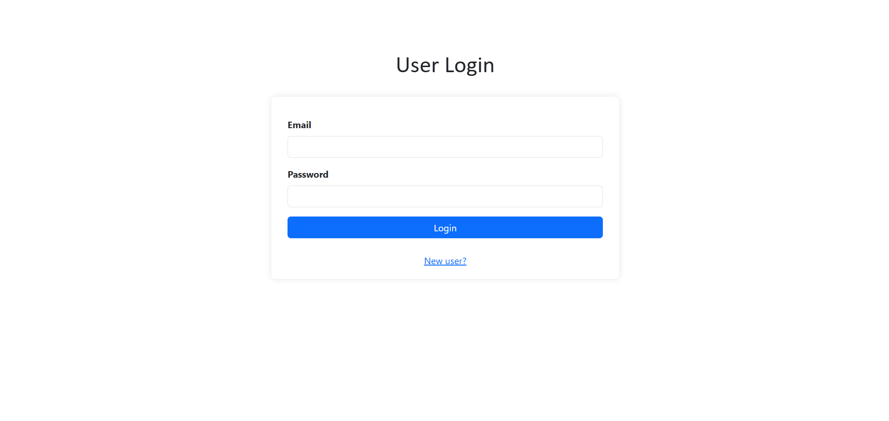
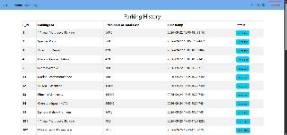
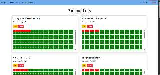
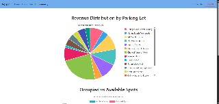

# ParkEase 🅿️

A Flask-based vehicle parking management system built as a course learning project. It supports two roles — **Users**, who can find and book parking spots, and an **Admin**, who manages parking lots and spots — with usage summaries visualized via Chart.js.


---

## Overview

ParkEase digitizes the day-to-day operations of managing paid parking lots: users can search for a lot, reserve the first available spot, park, and release it when leaving (with cost computed by the hour). Admins can create/edit/delete lots and spots, search lots by area/address/spot count/price, view all registered users, and see revenue and occupancy summaries per lot.

## Features

**User**
- Registration and login (with email and 10-digit phone number validation)
- Browse all parking lots or search by area
- Book the first available spot in a lot and get an auto-generated reservation
- Release a spot on leaving — cost is calculated as `⌈duration in hours⌉ × lot price`
- View personal parking history
- Cost-by-lot summary chart (Chart.js)
- Edit profile

**Admin**
- Default admin account seeded automatically on first run
- Add / edit / delete parking lots (auto-generates the lot's spots)
- Delete individual spots (blocked while occupied)
- Delete a lot (blocked while any of its spots are occupied)
- Search lots by area, address, spot count, or price
- View all registered users
- Revenue-by-lot and occupancy (available vs. occupied) summary dashboard with pie/bar charts
- Edit own admin profile

## Tech Stack

| Layer | Technology |
|---|---|
| Backend | Python, Flask |
| ORM / Database | Flask-SQLAlchemy, SQLite |
| Templating | Jinja2 |
| Frontend | HTML, CSS, Bootstrap 5 |
| Charts | Chart.js |

## Project Structure

```
vehicle_parking_app/
├── app.py                     # Flask app, routes, and business logic
├── requirements.txt
├── application/
│   ├── __init__.py
│   ├── database.py            # SQLAlchemy instance
│   └── model.py                # Admin, Users, Parking_lots, Parking_spots,
│                                # Reserve_parkingspots, Parking_history models
├── instance/
│   └── Parking_database.sqlite3
├── static/
│   └── css/
│       └── style.css
└── templates/
    ├── Userlogin.html
    ├── UserRegistration.html
    ├── Userdashboard.html
    ├── Usersummary.html
    ├── UserEditProfile.html
    ├── Admindashboard.html
    ├── Adminsearch.html
    ├── Adminusers.html
    ├── Adminsummary.html
    └── AdminEditProfile.html
```

## Getting Started

### Prerequisites
- Python 3.x
- pip

### Installation

```bash
git clone https://github.com/Adwaith-Balakrishnan/ParkEase.git
cd ParkEase

python -m venv venv
source venv/bin/activate      # Windows: venv\Scripts\activate

pip install -r requirements.txt
```


### Running the app

```bash
python app.py
```

The app runs at `http://127.0.0.1:5000/`. On first run it creates the SQLite database and seeds a default admin account:

```
Email: admin1234@xyz.com
Password: myapp1
```

### Usage
- Go to `/User/registration` to create a user account, then `/User/login` to sign in.
- Log in with the default admin credentials above to access `/Admin/Home`.

## Screenshots

### User Flow
| Login | Parking History |
|:---:|:---:|
|  |  |

### Admin Flow
| Dashboard | Summary Charts |
|:---:|:---:|
|  |  |

## Limitations

These are current gaps identified directly from the code:

- **Passwords stored in plaintext** — no hashing (e.g. `werkzeug.security`) is used for user or admin passwords.
- **Hardcoded secret key** — `app.secret_key = 'Secret_key'` is committed in source, not loaded from an environment variable.
- **`debug=True`** is left on in the entry point (`app.run(debug=True)`), which is unsafe for production.
- **Single hardcoded admin** — there is no admin registration or role-management flow; only one admin is seeded on first run.
- **No CSRF protection or input sanitization** beyond basic manual checks (e.g. email/phone format).
- **SQLite** is used directly with no migrations (e.g. Alembic), which doesn't scale well and makes schema changes fragile.
- **Booking time logic is approximate** — `user_bookspot` sets a placeholder `time_of_leaving` of `now + 1 hour` at booking time, while the actual cost on release is recalculated from real elapsed time; the initial value is never meaningful.
- **No automated tests** included.
- **No pagination** on lot/user listings, which won't scale with data volume.
- **Unique constraints** on email and 10-digit phone number could reject legitimate edge cases (e.g. no phone number).

## Future Scope

- Hash passwords and add proper session/auth security (e.g. Flask-Login).
- Move secrets and DB config to environment variables / a config file.
- Support multiple admins with role-based access control.
- Add spot selection (instead of auto-assigning first available) and lot geolocation/maps.
- Add payment gateway integration for bookings.
- Add email/SMS notifications for booking and release.
- Migrate from SQLite to PostgreSQL/MySQL with Alembic migrations for production use.
- Add automated tests (unit + integration) and CI.
- Separate the app into a REST API + frontend (or add API endpoints) for mobile client support.
- Add real-time spot availability updates (e.g. WebSockets).
- Deploy to a cloud platform (Render, Railway, etc.) with a live demo link.

## License

This project is licensed under the MIT License — see the [LICENSE](LICENSE) file for details.

## Author

**Adwaith Balakrishnan**
GitHub: [@Adwaith-Balakrishnan](https://github.com/Adwaith-Balakrishnan)
